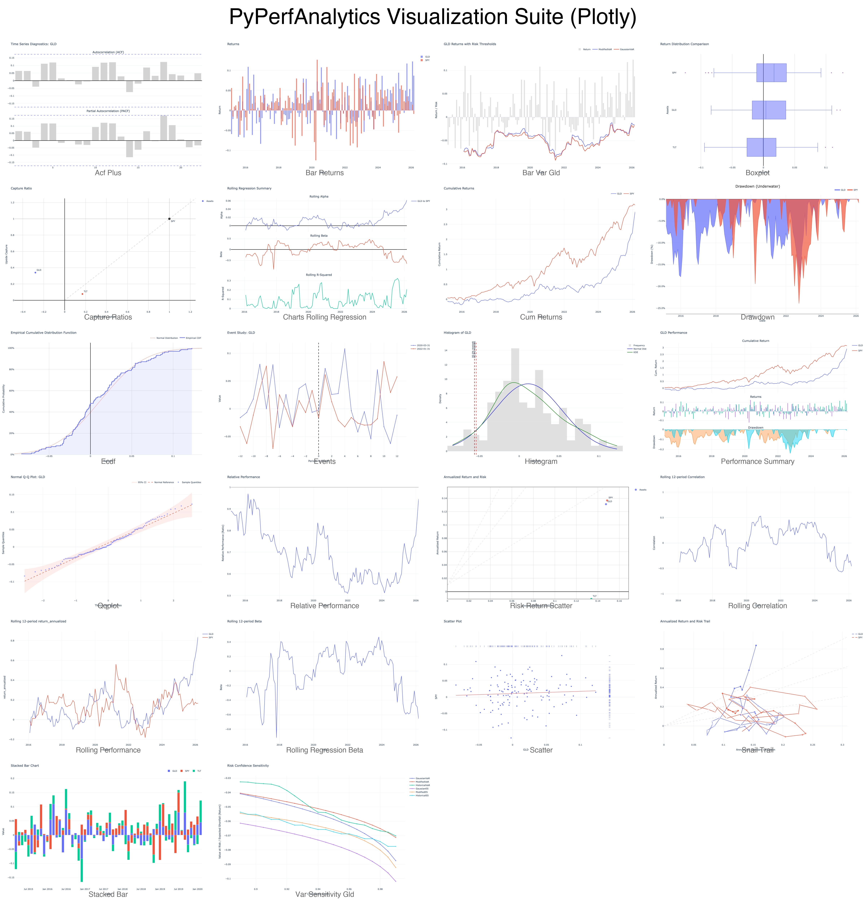

<div align="center">

# PyPerfAnalytics

[](https://www.gnu.org/licenses/old-licenses/gpl-2.0.en.html)
[](https://pypi.org/project/pyperfanalytics/)
[](https://pypi.org/project/pyperfanalytics/)
[](https://www.python.org/)
[](https://github.com/twn39/pyperfanalytics/actions/workflows/test.yml)
[](https://github.com/twn39/pyperfanalytics/actions/workflows/test.yml)

PyPerfAnalytics is a Python port of the popular R package `PerformanceAnalytics`. It provides a collection of functions for performance and risk analysis of financial portfolios.

</div>

The library ensures algorithmic consistency with the original R implementation, validated against R benchmarks with high precision.

## Key Features

- **Returns Calculation**: Cumulative, annualized, and excess returns.
- **Risk Metrics**: VaR (Historical, Gaussian, Modified), Expected Shortfall, Tracking Error, etc.
- **Performance Ratios**: Sharpe, Sortino, Information, Treynor, Calmar, Omega, Burke, and more.
- **Advanced Metrics**: Hurst Index, Smoothing Index (Getmansky), CDaR (Conditional Drawdown at Risk).
- **Summary Tables**: Comprehensive reporting tables for distributions, correlations, downside risk, and drawdowns.
- **Attribution**: Aggregation of asset contributions to portfolio returns.

## Visualization

PyPerfAnalytics includes a comprehensive suite of interactive plotting functions built on **Plotly**, designed to match the visual output and logic of the R `PerformanceAnalytics` package while providing modern web-based interactivity.



### Core Charts
- **Performance**: Cumulative Returns, Bar Returns, Drawdown (Underwater), and Performance Summaries.
- **Risk**: Bar VaR/ES overlays, Risk Confidence Sensitivity, and Histograms with risk markers.
- **Distribution**: Boxplots, Q-Q Plots, and ECDF (Empirical Cumulative Distribution Function).
- **Rolling Metrics**: Rolling Performance, Rolling Correlation, and Rolling Regression (Alpha, Beta, R-Squared).
- **Specialized**: Snail Trails (Rolling Risk-Return), Capture Ratios, ACF/PACF, and Event Studies.

## Installation

```bash
# Using uv (recommended)
uv pip install pyperfanalytics

# Using pip
pip install pyperfanalytics
```


## Quick Start

```python
import pandas as pd
import pyperfanalytics as pa

# 1. Load your return data (e.g., monthly returns of a fund and its benchmark)
# Data should be a pandas Series or DataFrame with a DatetimeIndex
url = "https://raw.githubusercontent.com/twn39/pyperfanalytics/main/data/managers.csv"
returns_data = pd.read_csv(url, index_col=0, parse_dates=True)

fund_return = returns_data["HAM1"].dropna()
benchmark_return = returns_data["SP500 TR"].dropna()
risk_free_rate = returns_data["US 3m TR"].dropna()

# 2. Calculate core performance metrics
ann_return = pa.return_annualized(fund_return)
ann_volatility = pa.std_dev_annualized(fund_return)
max_dd = pa.max_drawdown(fund_return)

print(f"Annualized Return: {ann_return:.2%}")
print(f"Annualized Volatility: {ann_volatility:.2%}")
print(f"Maximum Drawdown: {max_dd:.2%}")

# 3. Calculate Risk-Adjusted Ratios
# Traditional Sharpe
sharpe = pa.sharpe_ratio(fund_return, Rf=risk_free_rate, annualize=True)
# Sortino Ratio (using 0% as Minimum Acceptable Return)
sortino = pa.sortino_ratio(fund_return, MAR=0)
# Information Ratio (Active Return / Tracking Error)
info_ratio = pa.information_ratio(fund_return, benchmark_return)

# 4. Generate Comprehensive Summary Tables
# Returns summary including mean, std dev, skewness, kurtosis, etc.
stats_table = pa.table_stats(fund_return)
print(stats_table)

# Downside Risk summary table
downside_table = pa.table_downside_risk(fund_return)
print(downside_table)

# 5. Interactive Visualization
# Create an interactive Plotly chart of the Underwater Drawdown
fig = pa.chart_drawdown(fund_return)
fig.show()
```

## API Reference

A detailed, module-by-module API documentation with function signatures, parameter descriptions, and code examples is available in the [Docs Directory](api/index.md). Below is a quick overview of some commonly used functions.

### 1. Returns & Portfolio Management

#### `return_calculate(prices, method="discrete")`
Calculate returns from a price stream.
- **Parameters**:
    - `prices` (*pd.Series* or *pd.DataFrame*): Price levels.
    - `method` (*str*): Calculation method: `"discrete"` (default), `"log"` (continuous), or `"diff"` (absolute difference).
- **Example**:
```python
returns = pa.return_calculate(prices, method="log")
```

#### `return_annualized(R, scale=None, geometric=True)`
Calculate the annualized return.
- **Parameters**:
    - `R` (*pd.Series* or *pd.DataFrame*): Asset returns.
    - `scale` (*int*, optional): Number of periods in a year (e.g., 12 for monthly, 252 for daily). If None, it's inferred from the index.
    - `geometric` (*bool*): Whether to use geometric compounding.
- **Example**:
```python
ann_ret = pa.return_annualized(returns, scale=12)
```

#### `return_portfolio(R, weights=None, rebalance_on="none", geometric=True)`
Calculate the returns of a portfolio.
- **Parameters**:
    - `R` (*pd.DataFrame*): Returns of individual assets.
    - `weights` (*list* or *np.array*, optional): Asset weights. Defaults to equal weights.
    - `rebalance_on` (*str*): Rebalancing frequency: `"none"`, `"months"`, `"quarters"`, `"years"`.
- **Example**:
```python
port_ret = pa.return_portfolio(returns, weights=[0.6, 0.4], rebalance_on="quarters")
```

### 2. Risk Metrics

#### `max_drawdown(R, geometric=True)`
Calculate the maximum peak-to-trough loss.
- **Parameters**:
    - `R` (*pd.Series* or *pd.DataFrame*): Asset returns.
    - `geometric` (*bool*): Whether to use geometric returns for the equity curve.
- **Example**:
```python
mdd = pa.max_drawdown(returns)
```

#### `var_modified(R, p=0.95)`
Calculate Modified (Cornish-Fisher) Value at Risk (VaR). Adjusts for skewness and kurtosis.
- **Parameters**:
    - `R` (*pd.Series* or *pd.DataFrame*): Asset returns.
    - `p` (*float*): Confidence level (default 0.95).
- **Example**:
```python
m_var = pa.var_modified(returns, p=0.99)
```

#### `tracking_error(Ra, Rb, scale=None)`
Calculate the annualized standard deviation of excess returns relative to a benchmark.
- **Parameters**:
    - `Ra` (*pd.Series* or *pd.DataFrame*): Asset returns.
    - `Rb` (*pd.Series* or *pd.DataFrame*): Benchmark returns.
- **Example**:
```python
te = pa.tracking_error(returns, benchmark_returns)
```

### 3. Performance Ratios

#### `sharpe_ratio(R, Rf=0, p=0.95, FUN="StdDev", annualize=False)`
Calculate the Sharpe Ratio (return per unit of risk).
- **Parameters**:
    - `Rf` (*float* or *pd.Series*): Risk-free rate.
    - `FUN` (*str*): Risk measure to use: `"StdDev"`, `"VaR"`, `"ES"`, or `"SemiSD"`.
- **Example**:
```python
# Traditional Sharpe
sr = pa.sharpe_ratio(returns, Rf=0.02/12, annualize=True)
# Modified VaR-based Sharpe
sr_mod = pa.sharpe_ratio(returns, FUN="VaR")
```

#### `sortino_ratio(R, MAR=0)`
Calculate the Sortino Ratio (excess return per unit of downside risk).
- **Parameters**:
    - `MAR` (*float*): Minimum Acceptable Return (default 0).
- **Example**:
```python
sortino = pa.sortino_ratio(returns, MAR=0.05/12)
```

#### `omega_ratio(R, L=0)`
Calculate the Omega Ratio (probability-weighted gain vs loss).
- **Parameters**:
    - `L` (*float*): The threshold return (Level).
- **Example**:
```python
omega = pa.omega_ratio(returns, L=0)
```

### 4. Summary Tables

#### `table_stats(R, ci=0.95, digits=4)`
Comprehensive returns summary including mean, median, std dev, skewness, kurtosis, and confidence intervals.
- **Example**:
```python
stats = pa.table_stats(returns)
print(stats)
```

#### `table_downside_risk_ratio(R, MAR=0, scale=None)`
Summary table of downside risk metrics: Downside Deviation, Omega, Sortino, etc.
- **Example**:
```python
downside_table = pa.table_downside_risk_ratio(returns, MAR=0)
```

#### `table_capture_ratios(Ra, Rb, digits=4)`
Calculate Up and Down Capture ratios relative to a benchmark.
- **Example**:
```python
capture_table = pa.table_capture_ratios(returns, benchmark)
```

## Verification

Every function is verified against the R `PerformanceAnalytics` implementation using the `managers` and `edhec` standard datasets. Tests are located in the `tests/` directory and can be run using `pytest`.

*Note on Accuracy:* Where R's `PerformanceAnalytics` implementation contains known mathematical bugs (such as the `BurkeRatio` inadvertently scaling decimal inputs by `0.01` during drawdown calculations), `pyperfanalytics` corrects these bugs to produce accurate results for standard percentage-based analytics. In such explicitly documented cases, the library's output will intentionally deviate from the buggy R output to prioritize mathematical correctness.

*Note on Robust Estimation Tolerance:* The `return_clean(method="boudt")` function utilizes the Minimum Covariance Determinant (MCD) estimator. R's `PerformanceAnalytics` uses the `robustbase:covMcd` implementation (which includes specific finite sample corrections), while `pyperfanalytics` relies on `scikit-learn`'s `MinCovDet`. Due to inherent algorithmic differences in these foundational robust statistics libraries, the scale thresholds and identified outliers can slightly differ. Mathematical correctness is maintained, but outputs will exhibit minor variance from R.

```bash
uv run pytest
```

## License

This project is licensed under the GPL v2+ License - see the LICENSE file for details (matches original R PerformanceAnalytics).
